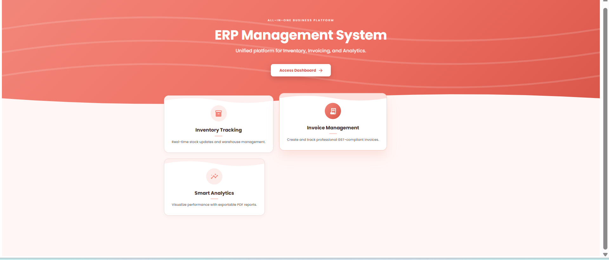
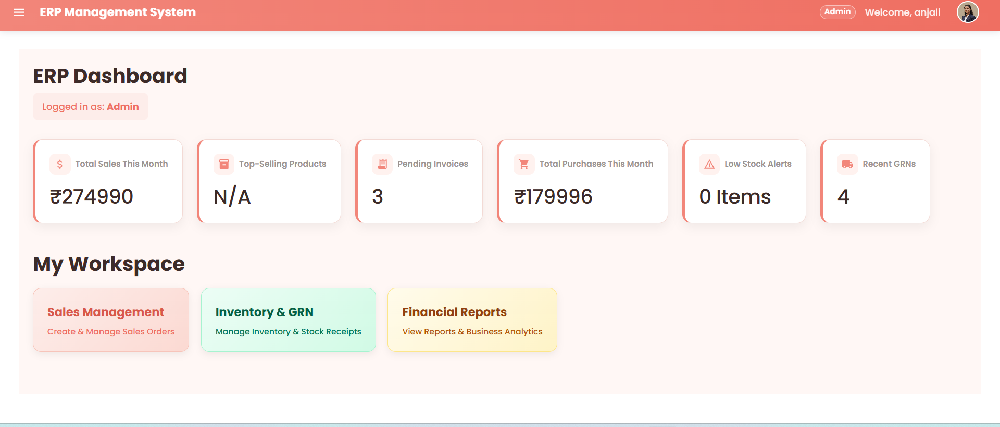
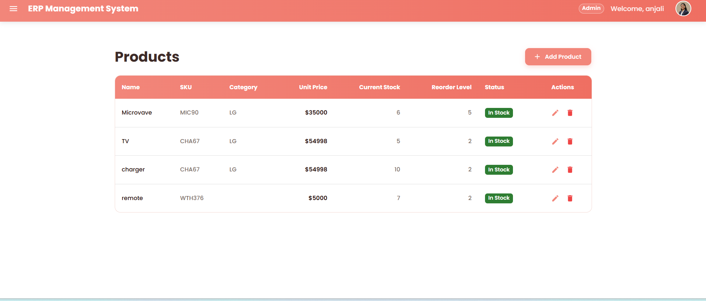
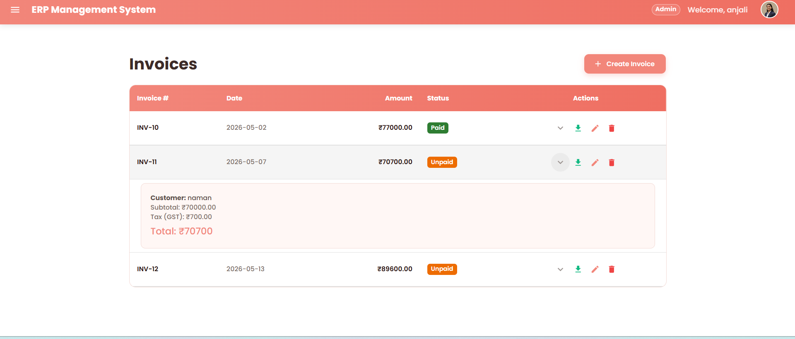
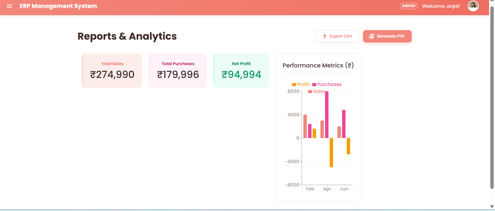
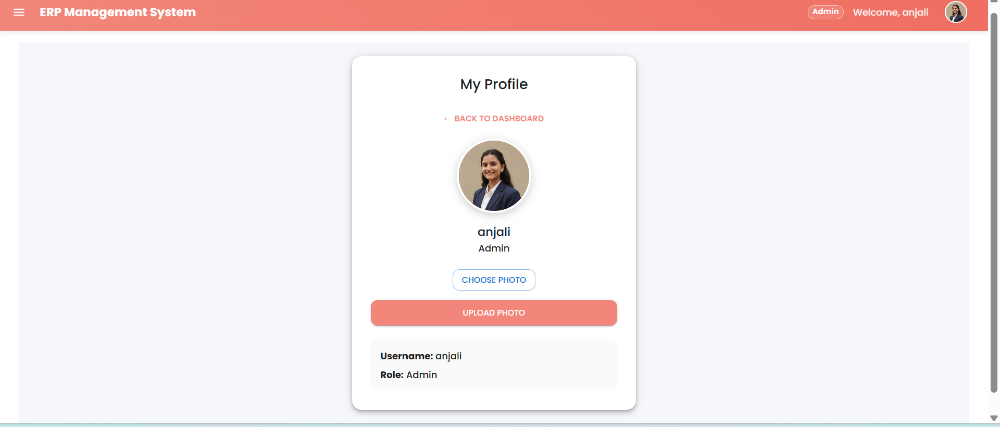

<div align="center">

# 🏢 ERP System

### *A full-stack Enterprise Resource Planning platform*

Manage customers, suppliers, inventory, purchase orders, sales, invoicing, and reporting — all from one dashboard.

[](https://erp-system-project-eight.vercel.app)
[](https://railway.app)
[](https://react.dev)
[](https://spring.io/projects/spring-boot)
[](https://www.mysql.com)
[](https://mui.com)

[**🚀 Live Demo**](https://erp-system-project-eight.vercel.app) · [**Report Bug**](https://github.com/anjali142507/ERP_System-Project-/issues) · [**Request Feature**](https://github.com/anjali142507/ERP_System-Project-/issues)

</div>

---

## 📖 Table of Contents

- [About](#-about)
- [Screenshots](#-screenshots)
- [Features](#-features)
- [Tech Stack](#-tech-stack)
- [Project Structure](#-project-structure)
- [Getting Started](#-getting-started)
- [Deployment](#-deployment)
- [API Overview](#-api-overview)
- [Contributing](#-contributing)

---

## 🏢 About

**ERP System** is a full-stack enterprise resource planning application that streamlines core business operations end-to-end — from raising a purchase order and recording goods received (GRN), to managing sales orders, generating invoices as downloadable PDFs, and tracking everything on a live analytics dashboard.

---

## 📸 Screenshots

<div align="center">

**Landing Page**



<br/><br/>

**Dashboard**



<br/><br/>

**Products** &nbsp;&nbsp;|&nbsp;&nbsp; **Invoices**

 

<br/><br/>

**Reports & Analytics** &nbsp;&nbsp;|&nbsp;&nbsp; **Profile**

 

</div>

---

## ✨ Features

| | |
|---|---|
| 📊 **Analytics Dashboard** | Sales summary, stock alerts, and business stats with chart visualizations (Recharts) |
| 👥 **Customer Management** | Add, view, and remove customer records |
| 🏭 **Supplier Management** | Maintain a directory of suppliers for procurement |
| 📦 **Product & Inventory** | Full product catalog with create, update, delete, and live stock counts |
| 🧾 **Purchase Orders** | Raise purchase orders and track status through their lifecycle |
| 📥 **Goods Receipt (GRN)** | Record goods received against purchase orders, with edit/delete support |
| 🛒 **Sales Orders** | Create sales orders and update their status as they progress |
| 💳 **Invoicing** | Generate invoices directly from a sales order; export as PDF (jsPDF + html2canvas) |
| 📈 **Reports** | Summary reporting across sales and inventory activity |
| 👤 **User Profiles** | Profile view with photo upload support |
| 🔐 **JWT Authentication** | Secure register/login flow backed by JSON Web Tokens |

---

## 🧰 Tech Stack

<table>
<tr>
<td valign="top" width="50%">

**Frontend**
- ⚛️ React 19 (Create React App)
- 🎨 Material UI (MUI) + Emotion
- 🧭 React Router
- 📋 React Hook Form + Yup validation
- 📊 Recharts
- 📄 jsPDF + html2canvas (PDF export)
- 🌐 Axios

</td>
<td valign="top" width="50%">

**Backend**
- ☕ Java 17, Spring Boot 3.2
- 🔐 Spring Security + JWT (`jjwt`)
- 🗄️ Spring Data JPA + MySQL
- ✅ Spring Validation
- 📘 springdoc-openapi (Swagger UI)
- 🧩 Lombok

</td>
</tr>
</table>

---

## 📁 Project Structure

```
ERP_System-Project-/
├── erp-frontend/          # React + MUI app
│   └── src/
│       ├── pages/         # Dashboard, Customers, Suppliers, Products,
│       │                  # PurchaseOrders, GRN, SalesOrders, Invoices, Reports...
│       ├── components/    # Navbar, Sidebar, ProtectedRoute, LandingPage
│       ├── context/       # AuthContext
│       ├── services/      # api.js, authService.js
│       └── routes/        # AppRouter
└── erp-system-backend/    # Spring Boot app
    └── src/main/java/com/erp/
        ├── controller/    # REST controllers (one per module)
        ├── service/       # Business logic
        ├── repository/    # Spring Data JPA repositories
        ├── entity/        # JPA entities
        ├── dto/           # Request/response DTOs
        └── security/      # JWT filter, JWT util, security config
```

---

## 🚀 Getting Started

### Prerequisites

- Node.js 18+
- Java 17+
- Maven
- MySQL (local or a hosted connection string)

### 1️⃣ Clone the repo

```bash
git clone https://github.com/anjali142507/ERP_System-Project-.git
cd ERP_System-Project-
```

### 2️⃣ Backend setup

```bash
cd erp-system-backend
```

The backend reads its MySQL connection from environment variables. Set these before running:

```env
MYSQLHOST=localhost
MYSQLPORT=3306
MYSQLDATABASE=erp_db
MYSQLUSER=root
MYSQLPASSWORD=your_mysql_password
```

Run the server:

```bash
mvn spring-boot:run
```

> API available at `http://localhost:8080`
> Swagger UI available at `http://localhost:8080/swagger-ui.html`

### 3️⃣ Frontend setup

```bash
cd erp-frontend
npm install
npm start
```

> App available at `http://localhost:3000`

---

## ☁️ Deployment

This project is deployed as two separate services:

| Service | Platform |
|---------|----------|
| Frontend (React) | [Vercel](https://vercel.com) |
| Backend (Spring Boot) | [Railway](https://railway.app) |
| Database (MySQL) | Railway MySQL plugin |

**Backend on Railway:**
- Railway auto-provisions a MySQL instance and injects `MYSQLHOST`, `MYSQLPORT`, `MYSQLDATABASE`, `MYSQLUSER`, and `MYSQLPASSWORD` as environment variables when the MySQL plugin is linked to the service — no manual `.env` file needed in production, unlike the local setup above.
- Railway builds the Spring Boot app from `erp-system-backend/pom.xml` and runs it via the Spring Boot Maven plugin.
- Once deployed, update `SecurityConfig`'s CORS allowed origins to include your production frontend URL (already includes `https://erp-system-project-eight.vercel.app`).

**Frontend on Vercel:**
- Set the build root to `erp-frontend/`.
- Add an environment variable pointing the frontend at the Railway backend URL (e.g. `REACT_APP_API_URL=https://your-backend.up.railway.app`), and make sure `services/api.js` reads from it.

---

## 🔌 API Overview

| Module | Method | Endpoint | Description |
|--------|:------:|----------|--------------|
| **Auth** | `POST` | `/api/auth/register` | Register a new user |
| | `POST` | `/api/auth/login` | Log in, returns a JWT |
| **Dashboard** | `GET` | `/api/dashboard/summary` | Overall dashboard summary |
| | `GET` | `/api/dashboard/stats` | Key business stats |
| | `GET` | `/api/dashboard/sales-summary` | Sales summary data |
| | `GET` | `/api/dashboard/stock-alerts` | Low-stock alerts |
| **Customers** | `GET` / `POST` | `/api/customers` | List / create customers |
| | `DELETE` | `/api/customers/{id}` | Remove a customer |
| **Suppliers** | `GET` / `POST` | `/api/suppliers` | List / create suppliers |
| | `DELETE` | `/api/suppliers/{id}` | Remove a supplier |
| **Products** | `GET` / `POST` | `/api/products` | List / create products |
| | `GET` | `/api/products/{id}` | Get a single product |
| | `GET` | `/api/products/count` | Total product count |
| | `PUT` / `DELETE` | `/api/products/{id}` | Update / delete a product |
| **Purchase Orders** | `GET` / `POST` | `/api/purchase-orders` | List / create purchase orders |
| | `PUT` | `/api/purchase-orders/{id}/status` | Update order status |
| | `DELETE` | `/api/purchase-orders/{id}` | Delete a purchase order |
| **GRN** | `GET` / `POST` | `/api/grns` | List / create goods receipt notes |
| | `PUT` / `DELETE` | `/api/grns/{id}` | Update / delete a GRN |
| **Sales Orders** | `GET` / `POST` | `/api/sales-orders` | List / create sales orders |
| | `PUT` | `/api/sales-orders/{id}/status` | Update order status |
| | `DELETE` | `/api/sales-orders/{id}` | Delete a sales order |
| **Invoices** | `GET` / `POST` | `/api/invoices` | List / create invoices |
| | `POST` | `/api/invoices/generate/{salesOrderId}` | Generate invoice from a sales order |
| | `PUT` / `DELETE` | `/api/invoices/{id}` | Update / delete an invoice |
| **Reports** | `GET` | `/api/reports/summary` | Reporting summary |
| **Profile** | `GET` | `/api/profile/{id}` | Get a user's profile |
| | `POST` | `/api/profile/upload/{id}` | Upload profile photo |

Full interactive API docs are also available via Swagger UI once the backend is running.

---

## 🤝 Contributing

Contributions, issues, and feature requests are welcome!

1. Fork the project
2. Create your feature branch (`git checkout -b feature/amazing-feature`)
3. Commit your changes (`git commit -m 'Add amazing feature'`)
4. Push to the branch (`git push origin feature/amazing-feature`)
5. Open a Pull Request

---

<div align="center">

Made with 💼 by [Anjali](https://github.com/anjali142507)

⭐ If you like this project, consider giving it a star!

</div>
